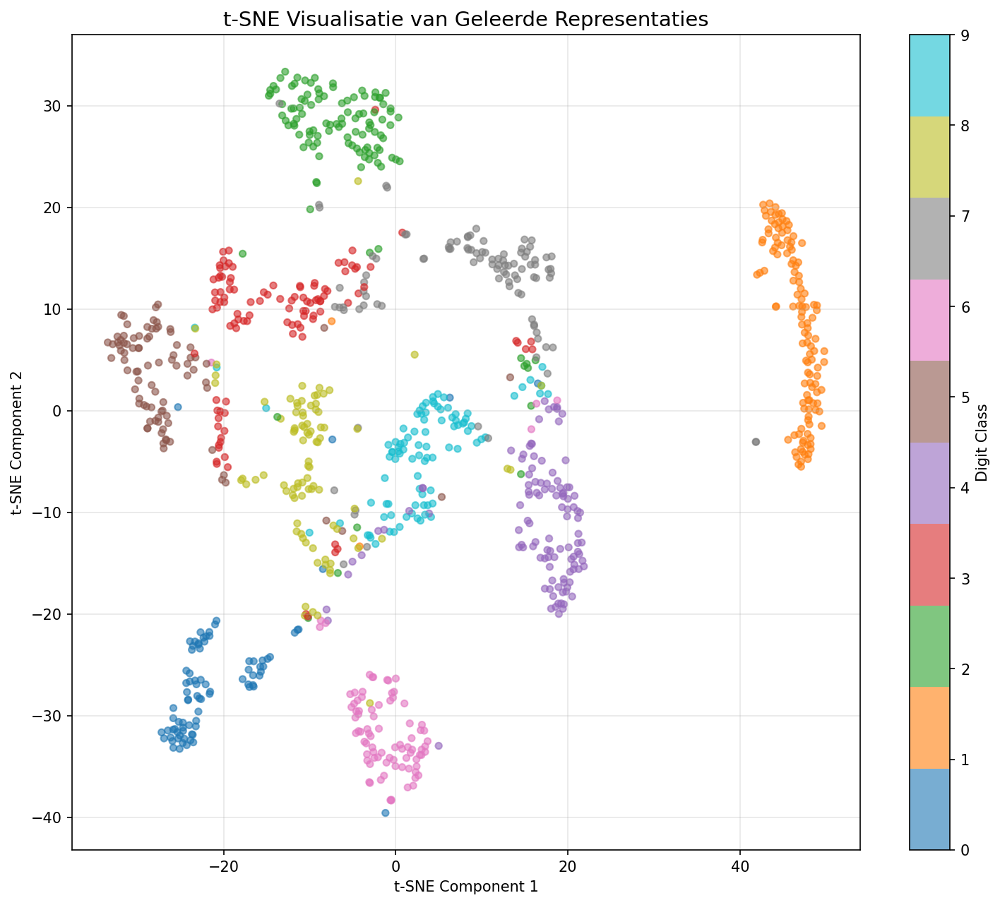

# Contrastive self-supervised learning on MNIST

Contrastive SSL on MNIST with a CNN encoder and NT‑Xent loss (PyTorch).

Short: embedding visualization (t-SNE/UMAP) of representations — colors show original labels and augmentations. Useful to check whether positive pairs are closer together.
